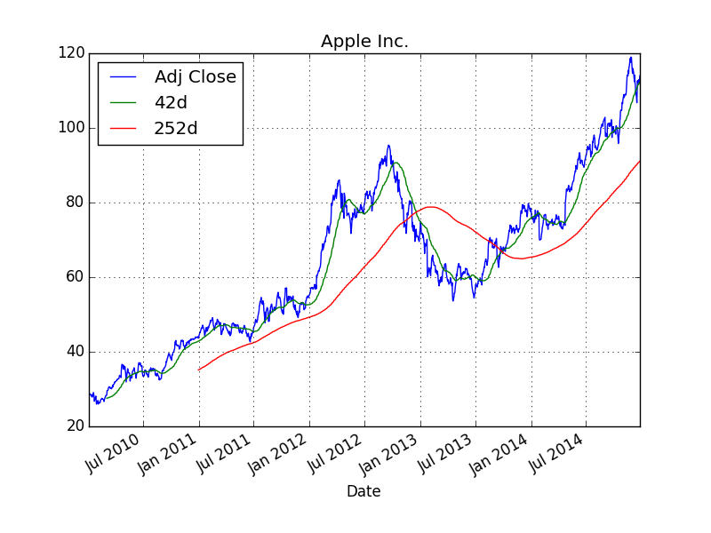

Raspberry Pi for Data Analytics
---------------------------------

This example is about data analytics with Python (cf. http://python.org) and IPython (cf. http://ipython.org) on the RPi. Before we install it, first install the Python PIP installer by::

    sudo apt-get install python-pip python-dev build-essential 

Any serious data analytics effort with Python generally includes to some extent the pandas library (cf. http://pandas.pydata.org). To install it, upgrade the NumPy library first (cf. http://scipy.org)::

    sudo pip install numpy --upgrade

This might take quite a while (1h+) due to the library being pretty large and the RPi not being that quick in compiling it. Then install pandas::

    sudo pip install pandas

This also takes some time (again 1h+). Also install the matplotlib plotting library (with some updates/dependencies) as follows::

    sudo easy_install -U distribute
    sudo apt-get install libpng-dev libjpeg8-dev libfreetype6-dev
    sudo pip install matplotlib

And, oh wonder, this also takes quite a while to install and compile. However, your patience will pay off: your RPi will be equipped with **state-of-the-art Python-based data analytics libraries** that can be used then for a wide range of data crunching tasks. Finally, install the IPython interactive analytics environment::

    sudo pip install ipython

Now start IPython on the shell via::

    ipython

You should then see something like::

    pi@rpi /home/ftp $ ipython
    Python 2.7.3 (default, Mar 18 2014, 05:13:23) 
    Type "copyright", "credits" or "license" for more information.

    IPython 2.3.1 -- An enhanced Interactive Python.
    ?         -> Introduction and overview of IPython's features.
    %quickref -> Quick reference.
    help      -> Python's own help system.
    object?   -> Details about 'object', use 'object??' for extra details.

    In [1]: 

Now let's retrieve some stock quotes for Apple stocks:

.. ipython::

    In [1]: import pandas.io.data as web

    In [2]: aapl = web.DataReader('AAPL', data_source='yahoo')

    In [3]: aapl.tail()
    Out[3]: 
                  Open    High     Low   Close    Volume  Adj Close
    Date                                                           
    2014-12-16  106.37  110.16  106.26  106.75  60790700     106.75
    2014-12-17  107.12  109.84  106.82  109.41  53411800     109.41
    2014-12-18  111.87  112.65  110.66  112.65  59006200     112.65
    2014-12-19  112.26  113.24  111.66  111.78  88429800     111.78
    2014-12-22  112.16  113.49  111.97  112.94  44976200     112.94

Next, let us caculate two different moving averages (42 days & 252 days):

.. ipython::

    In [4]: import pandas as pd

    In [5]: aapl['42d'] = pd.rolling_mean(aapl['Adj Close'], window=42)

    In [6]: aapl['252d'] = pd.rolling_mean(aapl['Adj Close'], window=252)

Finally, a plot of the index closing values and the moving averages:

.. ipython::

    In [7]: import matplotlib.pyplot as plt

    In [8]: aapl[['Adj Close', '42d', '252d']].plot(title='Apple Inc.'); plt.savefig('source/aapl.png')

The saved png plot might then look like below.

Via the shell (either directly or via ``ssh`` access) such figures cannot be displayed. However, you could imagine to run a Web site on the RPi where the figure is included and displayed via html. You could also send such a graphical output/result e.g. by email.
